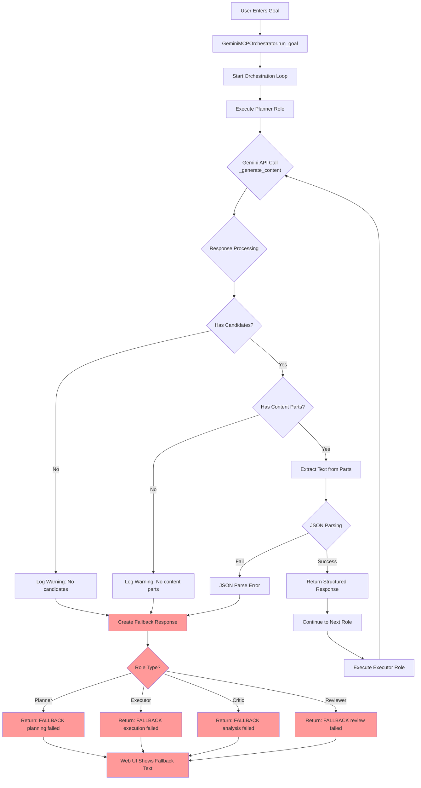

# Orchestrator Debug Flow Analysis

## Current Issue: Generic Fallback Responses

The web UI is showing generic fallback responses instead of actual AI-generated content. Here's the analysis of what's happening:

## Problem Areas Identified:

1. **Gemini API Response Issues**: The API might not be returning proper candidates or content
2. **JSON Schema Mismatch**: The response schema might not match what Gemini is actually returning
3. **Missing Error Logging**: We don't see what the actual Gemini response looks like
4. **Generic Fallbacks**: Instead of showing real errors, we show generic messages

## Solution Applied:

1. ✅ Added detailed logging to track API responses
2. ✅ Improved fallback responses to show actual error details
3. ✅ Added better error handling for API initialization
4. ✅ Enhanced JSON parsing error messages

## Next Steps:

Run the orchestrator and check the logs to see:
- If Gemini API is responding
- What the actual response format looks like
- Where exactly the failure is occurring
