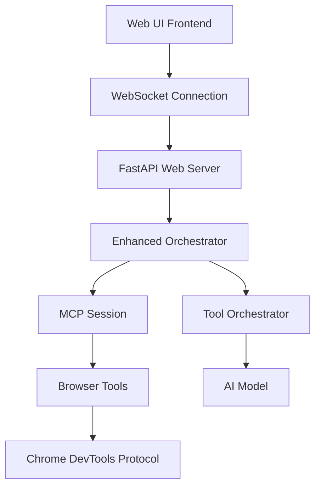

# MCP Chat UI Implementation Guide

## Overview

This guide demonstrates how to build a real-time web interface for an MCP (Model Context Protocol) server with live chat capabilities, tool execution monitoring, and visual feedback. The implementation combines FastAPI, WebSockets, and an AI orchestrator to create an interactive experience for AI agent interactions.

## Architecture Overview



## Key Components

### 1. FastAPI Web Server with WebSocket Support

The foundation is a FastAPI application that serves both static HTML and provides real-time WebSocket communication:

```python
from fastapi import FastAPI, WebSocket, WebSocketDisconnect
from fastapi.responses import HTMLResponse
import uvicorn
import asyncio
import json

app = FastAPI(title="MCP Chat UI")
connections: List[WebSocket] = []

@app.websocket("/ws")
async def websocket_endpoint(websocket: WebSocket):
    await websocket.accept()
    connections.append(websocket)
    # Handle real-time communication
```

### 2. MCP Integration Layer

The core integration connects to MCP servers and manages tool execution:

```python
class MCPChatInterface:
    def __init__(self):
        self.orchestrator = None
        self.mcp_session = None
        
    async def initialize(self):
        """Initialize MCP connection and orchestrator"""
        self.orchestrator = EnhancedConversationalOrchestrator()
        await self.orchestrator.initialize()
        
    async def execute_with_monitoring(self, user_input: str, websocket: WebSocket):
        """Execute user request with real-time updates"""
        # Monitor tool calls and send updates
        result = await self.orchestrator.process_user_input(user_input)
        return result
```

### 3. Real-Time Message Protocol

Define a structured message protocol for WebSocket communication:

```python
# Message Types
MESSAGE_TYPES = {
     'status': 'System status updates',
    'assistant_thinking': 'AI processing indication',
    'tool_start': 'Tool execution begins',
    'tool_complete': 'Tool execution finished',
    'assistant_response': 'AI response content',
    'screenshot': 'Visual content capture',
    'error': 'Error notifications'
}

# Message Structure
{
    "type": "tool_start",
    "data": {
        "tool_name": "navigate",
        "arguments": {"url": "https://example.com"},
        "message": "🔧 Executing navigate...",
        "timestamp": "2025-10-30T10:30:00.000Z"
    }
}
```

## Implementation Details

### 1. Enhanced Orchestrator Integration

Create an orchestrator that can work with MCP tools and provide monitoring:

```python
class EnhancedMCPOrchestrator:
    def __init__(self):
        self.mcp_session = None
        self.tool_orchestrator = None
        
    async def initialize(self):
        """Set up MCP connection and tool management"""
        # Initialize MCP session
        # Set up tool orchestrator
        # Configure AI model integration
        
    async def process_user_input(self, user_input: str):
        """Process user input with tool execution monitoring"""
        # Parse user intent
        # Plan tool execution
        # Execute tools with monitoring
        # Generate response
        
    async def monitor_tool_execution(self, tool_call, websocket):
        """Monitor and broadcast tool execution status"""
        # Send tool start notification
        # Execute tool with error handling
        # Send completion notification
        # Handle special tool types (screenshots, etc.)
```

### 2. Tool Execution Monitoring

Implement tool execution wrapping to provide real-time feedback:

```python
async def monitored_tool_execute(self, tool_call, websocket):
    """Wrap tool execution with monitoring"""
    tool_name = tool_call["function"]["name"]
    
    # Notify start
    await self.send_websocket_message(websocket, {
        "type": "tool_start",
        "data": {
            "tool_name": tool_name,
            "message": f"🔧 Executing {tool_name}...",
            "timestamp": datetime.now().isoformat()
        }
    })
    
    try:
        # Execute the actual tool
        result = await self.original_execute(tool_call)
        
        # Notify completion
        await self.send_websocket_message(websocket, {
            "type": "tool_complete", 
            "data": {
                "tool_name": tool_name,
                "success": result.error is None,
                "result": result.result,
                "execution_time": result.execution_time,
                "message": f"✅ {tool_name} completed",
                "timestamp": datetime.now().isoformat()
            }
        })
        
        return result
        
    except Exception as e:
        # Notify error
        await self.send_websocket_message(websocket, {
            "type": "error",
            "data": {
                "message": f"❌ Error in {tool_name}: {str(e)}",
                "timestamp": datetime.now().isoformat()
            }
        })
        raise
```

### 3. Frontend Interface Design

Create a responsive HTML interface with real-time updates:

```html
<!DOCTYPE html>
<html>
<head>
    <title>MCP Chat Interface</title>
    <style>
        /* Modern, clean styling */
        .container { display: flex; flex-direction: column; height: 100vh; }
        .chat-container { flex: 1; overflow-y: auto; padding: 20px; }
        .message { margin-bottom: 20px; animation: slideIn 0.5s ease; }
        .role-badge { padding: 6px 12px; border: 1px solid; font-size: 12px; }
        .controls { padding: 20px; border-top: 1px solid #e0e0e0; }
        .screenshot-image { max-width: 100%; cursor: pointer; }
    </style>
</head>
<body>
    <div class="container">
        <div class="chat-container" id="chatContainer"></div>
        <div class="controls">
            <input type="text" id="userInput" placeholder="Enter your request...">
            <button id="sendBtn">Send</button>
        </div>
    </div>
    
    <script>
        class MCPChatUI {
            constructor() {
                this.websocket = null;
                this.initializeWebSocket();
                this.setupEventListeners();
            }
            
            initializeWebSocket() {
                const wsUrl = `ws://${window.location.host}/ws`;
                this.websocket = new WebSocket(wsUrl);
                
                this.websocket.onmessage = (event) => {
                    const message = JSON.parse(event.data);
                    this.handleMessage(message);
                };
            }
            
            handleMessage(message) {
                // Process different message types
                // Update UI accordingly
                // Handle special content like screenshots
            }
        }
    </script>
</body>
</html>
```

## Model Integration

### 1. AI Model Configuration

Configure your AI model for MCP tool interaction:

```python
class ModelConfig:
    def __init__(self):
        self.model_name = "gemini-1.5-flash"  # or your preferred model
        self.temperature = 0.1
        self.max_tokens = 4000
        
    def get_system_prompt(self):
        return """
        You are an AI assistant with access to browser automation tools through MCP.
        You can:
        - Navigate web pages
        - Extract information
        - Take screenshots
        - Interact with page elements
        
        Always explain your actions and provide clear feedback to the user.
        """

class AIModelInterface:
    def __init__(self, config: ModelConfig):
        self.config = config
        self.client = None  # Initialize your AI client
        
    async def generate_response(self, messages, tools_available):
        """Generate AI response with tool awareness"""
        # Format messages for your AI model
        # Include available tools in the prompt
        # Handle tool calling decisions
        
    async def process_tool_results(self, tool_results):
        """Process tool execution results"""
        # Analyze tool outputs
        # Generate appropriate responses
        # Decide on next actions
```

### 2. Tool Registration and Management

Register MCP tools with your AI model:

```python
class MCPToolRegistry:
    def __init__(self):
        self.available_tools = {}
        
    async def discover_mcp_tools(self, mcp_session):
        """Discover available MCP tools"""
        tools_list = await mcp_session.list_tools()
        
        for tool in tools_list.tools:
            self.available_tools[tool.name] = {
                'name': tool.name,
                'description': tool.description,
                'input_schema': tool.inputSchema
            }
            
    def format_tools_for_model(self):
        """Format tools for AI model consumption"""
        formatted_tools = []
        
        for tool_name, tool_info in self.available_tools.items():
            formatted_tools.append({
                "type": "function",
                "function": {
                    "name": tool_name,
                    "description": tool_info['description'],
                    "parameters": tool_info['input_schema']
                }
            })
            
        return formatted_tools
```

## Special Features Implementation

### 1. Screenshot Handling

Implement automatic screenshot capture and display:

```python
async def handle_screenshot_result(self, tool_name, result, websocket):
    """Handle screenshot tool results specially"""
    if tool_name == "take_screenshot" and result.error is None:
        # Extract base64 image data
        image_data = self.extract_image_data(result)
        
        if image_data:
            await self.send_websocket_message(websocket, {
                "type": "screenshot",
                "data": {
                    "image_data": image_data,
                    "message": "📸 Screenshot captured",
                    "timestamp": datetime.now().isoformat()
                }
            })

def extract_image_data(self, result):
    """Extract base64 image data from tool result"""
    # Handle different result formats
    # Clean and validate image data
    # Return processed base64 string
```

### 2. Error Recovery and Retry Logic

Implement robust error handling:

```python
class ErrorRecoveryManager:
    def __init__(self, max_retries=3):
        self.max_retries = max_retries
        
    async def execute_with_retry(self, tool_call, websocket):
        """Execute tool with automatic retry on failure"""
        for attempt in range(self.max_retries):
            try:
                result = await self.execute_tool(tool_call)
                
                if result.error is None:
                    return result
                    
                # Analyze error and decide on retry
                if self.should_retry(result.error):
                    await self.send_retry_notification(websocket, attempt + 1)
                    await asyncio.sleep(2 ** attempt)  # Exponential backoff
                    continue
                else:
                    break
                    
            except Exception as e:
                if attempt == self.max_retries - 1:
                    raise
                await asyncio.sleep(1)
                
        return result
        
    def should_retry(self, error):
        """Determine if error is retryable"""
        retryable_errors = [
            "TimeoutError",
            "ConnectionError", 
            "TemporaryFailure"
        ]
        return any(err in str(error) for err in retryable_errors)
```

## Startup and Configuration

### 1. Application Initialization

```python
class MCPChatApplication:
    def __init__(self):
        self.app = FastAPI(title="MCP Chat Interface")
        self.orchestrator_ui = None
        
    async def startup(self):
        """Initialize all components"""
        # Initialize MCP connections
        # Set up AI model interface
        # Configure tool registry
        # Start background services
        
    def run(self, host="127.0.0.1", port=8000):
        """Run the application"""
        uvicorn.run(
            self.app,
            host=host,
            port=port,
            log_level="info"
        )

# Application entry point
if __name__ == "__main__":
    app = MCPChatApplication()
    asyncio.run(app.startup())
    app.run()
```

### 2. Environment Configuration

Create configuration for different environments:

```python
# config.py
class Config:
    MCP_SERVER_URL = "stdio://path/to/mcp/server"
    AI_MODEL = "gemini-1.5-flash"
    MAX_CONCURRENT_TOOLS = 3
    WEBSOCKET_TIMEOUT = 30
    SCREENSHOT_QUALITY = 90
    
class DevelopmentConfig(Config):
    DEBUG = True
    LOG_LEVEL = "DEBUG"
    
class ProductionConfig(Config):
    DEBUG = False
    LOG_LEVEL = "INFO"
```

## Usage Examples

### 1. Basic User Interaction

```javascript
// Frontend usage
const chatUI = new MCPChatUI();

// Send user request
chatUI.sendMessage("Navigate to Google and search for 'MCP protocol'");

// Handle different message types
chatUI.onMessage('tool_start', (data) => {
    console.log(`Starting tool: ${data.tool_name}`);
});

chatUI.onMessage('screenshot', (data) => {
    displayScreenshot(data.image_data);
});
```

### 2. Custom Tool Integration

```python
# Add custom MCP tool
async def register_custom_tool(mcp_session):
    """Register a custom tool with the MCP server"""
    tool_definition = {
        "name": "extract_data",
        "description": "Extract structured data from web pages",
        "inputSchema": {
            "type": "object",
            "properties": {
                "selector": {"type": "string"},
                "format": {"type": "string"}
            }
        }
    }
    
    await mcp_session.register_tool(tool_definition)
```

## Best Practices

### 1. Performance Optimization

- Use connection pooling for WebSocket management
- Implement message queuing for high-frequency updates
- Cache frequently used tool results
- Optimize image compression for screenshots

### 2. Security Considerations

- Validate all user inputs
- Sanitize tool parameters
- Implement rate limiting
- Secure WebSocket connections with authentication

### 3. Error Handling

- Provide clear error messages to users
- Implement graceful degradation
- Log errors for debugging
- Offer retry mechanisms for transient failures

### 4. User Experience

- Show loading states during tool execution
- Provide progress indicators for long-running tasks
- Enable real-time feedback and cancellation
- Implement keyboard shortcuts and accessibility features

## Deployment

### 1. Docker Configuration

```dockerfile
FROM python:3.11-slim

WORKDIR /app
COPY requirements.txt .
RUN pip install -r requirements.txt

COPY . .
EXPOSE 8000

CMD ["python", "main.py"]
```

### 2. Production Considerations

- Use reverse proxy (nginx/traefik)
- Implement SSL/TLS termination
- Set up monitoring and logging
- Configure auto-scaling based on WebSocket connections

## Conclusion

This implementation provides a robust foundation for building MCP-enabled chat interfaces with real-time capabilities. The architecture is extensible and can be adapted for various use cases, from simple tool execution to complex multi-step workflows with visual feedback.

The key advantages of this approach:

1. **Real-time Updates**: Users see tool execution in real-time
2. **Visual Feedback**: Screenshots and images are automatically displayed
3. **Error Recovery**: Robust error handling with retry logic
4. **Extensible Architecture**: Easy to add new tools and capabilities
5. **Modern UI**: Responsive design with smooth animations

This guide serves as a template that can be customized for specific MCP server implementations and AI model integrations.